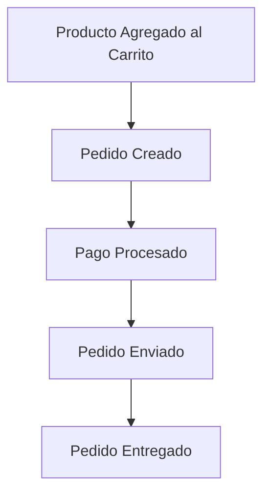

# **Taller de Event Storming: Ejemplo - Tienda en Línea**

## **1. Introducción**
Event Storming es una técnica de modelado colaborativo para entender y diseñar sistemas a partir de eventos del dominio. En este ejemplo, modelaremos una **tienda en línea** desde la selección de productos hasta la entrega del pedido.

---
## **2. Eventos del Dominio**
Los eventos representan cosas que suceden en el sistema y se escriben en **pasado**.



---
## **3. Actores y Comandos**
Los actores son quienes interactúan con el sistema y los comandos representan acciones que desencadenan eventos.

```yaml
Actores:
- Cliente
- Sistema de Pagos
- Sistema de Envíos

Comandos:
- Agregar Producto al Carrito
- Crear Pedido
- Procesar Pago
- Enviar Pedido
- Confirmar Entrega
```

---
## **4. Agregados y Políticas**
Los agregados representan unidades lógicas del sistema y las políticas definen reglas de negocio.

```yaml
Agregados:
- Carrito de Compras
- Pedido

Políticas:
- Verificar Stock Antes de Confirmar Pedido
- Validar Método de Pago Antes de Procesarlo
- Notificar al Cliente sobre el Estado del Pedido
```

---
## **5. Problemas Identificados**
Durante el taller, pueden surgir dudas o problemas que necesitan ser resueltos.

```yaml
Problemas:
- ¿Qué sucede si el pago es rechazado?
- ¿Cómo manejamos productos sin stock?
- ¿Cómo gestionamos devoluciones?
```

---
## **6. Refinamiento y Modelado del Dominio**
Basándonos en los eventos, podemos identificar **bounded contexts** dentro de la arquitectura del sistema.

```yaml
Bounded Contexts:
- Carrito de Compras
- Procesamiento de Pedidos
- Envíos
```

---
## **7. Conclusión**
Este Event Storming nos permite visualizar el flujo de eventos y mejorar la colaboración entre equipos técnicos y de negocio, asegurando una mejor comprensión del dominio de la tienda en línea.

🚀 **¡Ahora estás listo para aplicar Event Storming en tus proyectos!**
